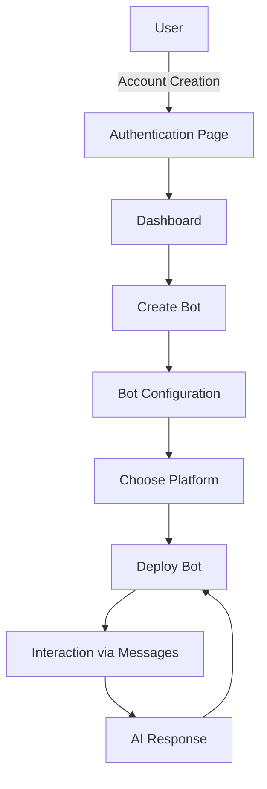
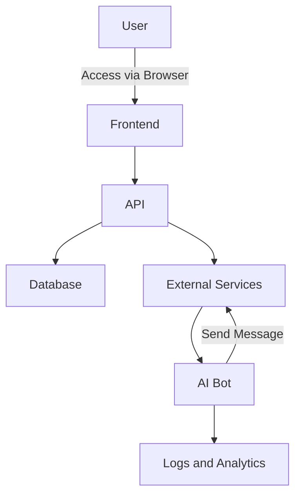

# Web Application Specifications: AI Bots for Messaging Platforms

## Steps

### Tasks

- [x] user creation
- [x] user update
- [x] bot creation
- [x] bot update
- [] list user's bots
- [] messaging platform creation
- [] messaging platform start
- [] messaging platform paring
- [] messaging platform stop
- [] list bot's messaging platforms
- [] read message and generate response
- [] send response

### Bonus tasks

- [] Chat blacklist

## Objective

This web application allows users to create AI-based bots, deploy them on different messaging platforms (WhatsApp, Telegram, etc.), and interact with them in a human-like manner.

## Features

### 1. User Authentication

- Users should be able to log in to the application via an authentication form.
- The application must support standard authentication (email/password).

### 2. Bot Creation

- Users can create a bot by providing a custom AI prompt.
- Each bot can be configured with platform-specific instructions (e.g., adapting the language according to the platform).

### 3. Supported Messaging Platforms

- Bots can be deployed on multiple messaging platforms, including:
  - WhatsApp
  - Telegram
  - Other platforms (to be defined)

### 4. Bot Deployment

- Users can choose which messaging platform to deploy their bot on.
- The bot can be launched on multiple platforms simultaneously, but it must adhere to human-like timing constraints to avoid automated behaviors.

### 5. Profile Configuration

- Users can configure their profiles on messaging platforms (WhatsApp, Telegram, etc.).
  - For example: WhatsApp authentication, linking their account to the bot API, etc.
- The application must store configuration data securely.

### 6. Bot Interaction with Messages

- When a message is received by the bot, it reads the message and generates a response via AI.
- The bot must simulate human behavior:
  - Limit actions to one at a time (no rapid sending of multiple messages).
  - Responses must be realistic and contextually appropriate for the received message.

## Technical Constraints

- **Performance and Human Behavior**:
  - The bot must behave realistically on messaging platforms (no spamming, no overly fast responses).
  - A reasonable delay should be introduced between each response to simulate a natural interaction.
  
## System Architecture

### Flow Diagram

### Architecture Diagram

## Security

- User credentials must be stored securely (hashed passwords).
- Connections to messaging platforms must be secured via APIs and tokens.

## Testing

- Tests must be conducted to validate the correct behavior of bots on each platform.
- Test the bot's ability to handle incoming messages and respond realistically.

This translated specifications outline the project features and constraints along with flow and architecture diagrams. You can adjust these details as per your project's specific needs.
